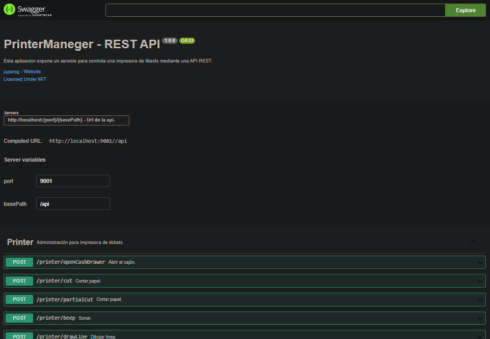

# Tikets Printer Manager 🖨

Esta aplicacion expone un servicio para controla una impresora de tikects mediante API REST.

🎖 Agradecimientos a [Klemen1337](https://github.com/Klemen1337) por su libreria 📦 [Node Thermal Printer](https://github.com/Klemen1337/node-thermal-printer)

Tecnologías usadas:
* nodejs
* express
* node-thermal-printer

## Clonar el repo e instalar dependecias.

clonar el repositorio con git:
```
git clone https://github.com/juparog/tikets-printer-manager.git
```

instalar dependecias con npm:
```
npm install
```

## Ejecucion para desarrollo.

iniciar el servicio:
```
npm run start:dev
```

## Ejecucion para produccion.

construir el ejecutable:
```
npm run build
```

iniciar el servicio:
```
npm run start
```

## Documentación

Los endpoint permitidos por la api se exponen a traves de Swagger, inicie el servicio y dirijace a la ruta: **/api-docs**.



---
Autor: 👨‍💻 https://github.com/juparog
